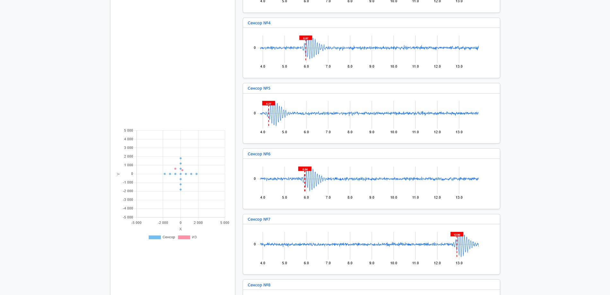

# How to use

1. Create and activate virtual environment using `./.venv/Scripts/activate`
2. Install requirements from `requirements.txt`
3. Run `fastapi dev` or `fastapi run`
4. Visit `127.0.0.1:8000`

