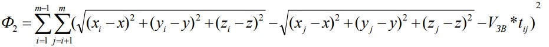

# How to use

1. Create and activate virtual environment via `python -m venv .venv` and `./.venv/Scripts/activate`
2. Install requirements via `pip install -r requirements.txt`
3. Run `fastapi dev` or `fastapi run`
4. Visit `127.0.0.1:8000`

# What it does

1. Emulates sound propagation from the noise source and the response from the cluster of (seismo-)acoustic sensors.
2. Detects occurence of some event and records time of its arrival for every sensor using STA/LTA method.
3. Calculates coordinates of the noise source that caused the event using Time Differences of Arrival (TDoA):

|  |
|:--:|
| *The calculation comes down to minimization of this functional. Here (x, y, z) are coordinates of the noise source.* |

4. And finally, outputs the result to the web-based GUI.

---

